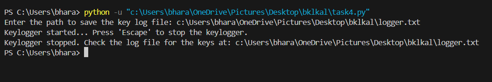

# PRODIGY_CS_04

# Basic Keylogger Program

This is a **basic keylogger program** written in Python that captures and logs keystrokes in real-time. The keystrokes are stored in a file (`logger.txt`), allowing the user to monitor the input. This script uses the `pynput` library to intercept keyboard events.

---

## Features
- Records alphanumeric keys and special keys (e.g., Enter, Space, Backspace).
- Logs all keystrokes into a file (`logger.txt`) for later reference.
- Stops execution when the **Escape** key is pressed.
- Simple and lightweight.

---

## Requirements

### 1. **System Requirements**
- **Windows** or **Linux** system:
  - Ensure you have Python installed (3.7 or higher).
  - Admin privileges are not mandatory unless restricting the path to save logs.

### 2. **Python Libraries**
- **pynput**:
  Install using pip:
  ```bash
  pip install pynput
```

## Logger file :
The keystrokes are saved in a logger file . Check the [**Logger.txt**](https://github.com/Indira12-gopal/PRODIGY_CS_04/blob/main/logger.txt) from here .

## Output on terminal :

